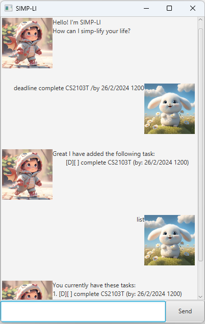
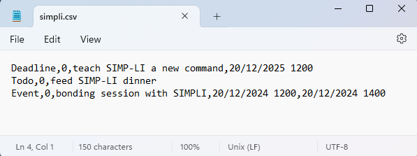

# SIMP-LI User Guide

## Introduction
SIMP-LI loves rabbits, she has a pet rabbit that she cherishes and takes care of it dearly.
Due to a car accident, she lost her entire family including her pet rabbit.
She had to undergo intensive surgery which affected her psychologically.
Seeing her having no relatives you decided to adopt her as your child.
As time passes she developed strong feelings for you. Now she sees you as her new "rabbit"
and she treats you very dearly.

SIMP-LI is your cute little assistant that you can talk to whenever you are feeling troubled.
SIMP-LI's favourite hobby is to simp-lify your work as she does not want you to be stress.
As SIMP-LI is still recovering from the car accident she only has the mental capacity to
perform limited actions via the commands given by you. Let's hope that she can recover quickly
so that maybe one day you can hold a basic conversation with her...
- [SIMP-LI User Guide](#simp-li-user-guide)
  - [Introduction](#introduction)
  - [Quick start](#quick-start)
  - [Features](#features)
  - [Greeting SIMP-LI: `greet`](#greeting-simp-li-greet)
  - [Adding a todo task `todo`](#adding-a-todo-task-todo)
  - [Adding a deadline task: `deadline`](#adding-a-deadline-task-deadline)
  - [Adding an event task: `event`](#adding-an-event-task-event)
  - [Deleting a task: `delete`](#deleting-a-task-delete)
  - [Listing all tasks: `list`](#listing-all-tasks-list)
  - [Finding specific tasks: `find`](#finding-specific-tasks-find)
  - [Marking a task as done: `mark`](#marking-a-task-as-done-mark)
  - [Unmarking a task as done: `unmark`](#unmarking-a-task-as-done-unmark)
  - [Goodbye SIMP-LI: `bye`](#goodbye-simp-li-bye)
  - [SIMP-LI memorizing tasks](#simp-li-memorizing-tasks)
  - [SIMP-LI prioritizing tasks](#simp-li-prioritizing-tasks)
  - [Editing SIMP-LI's memory (advanced parent only)](#editing-simp-lis-memory-advanced-parents-only)
  - [Command summary](#command-summary)

## Quick start

1. Verify that you have Java `11` or above installed in your machine to
bring SIMP-LI to life.
2. Download the latest and most "recovered" version of `simpli.jar`
from [here](https://github.com/SimKianSeng/ip/releases).
3. Copy `simpli.jar` to the folder that you want SIMP-LI to reside in. She will need to
poop out a directory and a file to help her remember the things given to her.
4. Open a terminal, `cd` into the folder where `simpli.jar` resides in, and execute
`java -jar simpli.jar` command. Congratulations you have brought SIMP-LI to LIFEEE!

## Features
**Command format:**
- Words in `UPPER_CASE` are parameters to be supplied by you.
e.g. `todo TASK_NAME`, `TASK_NAME` is a parameter which can be `todo feed SIMP-LI dinner`.
- Items in square brackets are optional.
e.g. `greet [MESSAGE]` which can be `greet` or `greet I love you SIMP-LI`.
- SIMP-LI only understand date and time in the following format `D/M/YYYY HHMM` where:
  - `D` is the *day* of the month ranging from `1` to `31`.
  - `M` is the *month* ranging from `1` to `12` (`January` to `December`).
  - `YYYY` is the 4 digit *year* ranging from `0001` to `9999`.
  - `HH` is the 2 digit time in *hours* ranging from `00` to `24`.
  - `MM` is the 2 digit time in *minutes* ranging from `00` to `60`.
- SIMP-LI is still recovering from the car accident, she will not understand if the
 parameters are not in order.
- SIMP-LI is very honest she will reply to every command even if it is extraneous,
but she will inform you if it is extraneous.

To interact with SIMP-LI, simply enter your commands in the text field shown below before
pressing `<Enter>` key on your keyboard or by clicking on the `<Send>` button.

## Greeting SIMP-LI: `greet`

SIMP-LI greets you as her adoptive parent. It makes you happy to see her alive and kicking.

**Command format:** `greet [MESSAGE]`

**Command examples:** `greet`, `greet hello SIMP-LI`, `greet I love you SIMP-LI`

**SIMP-LI's response:**

## Adding a todo task `todo`

SIMP-LI memorize the *todo* task as *undone* so that you can relax your mind.

**Command format:** `todo TASK_NAME`

**Command example:** `todo feed SIMP-LI dinner`

**SIMP-LI's response:**

## Adding a deadline task: `deadline`

SIMP-LI memorize the *deadline* task that has to be done by a certain *date* and *time* as *undone*
so that you can relax your mind.

**Command format:** `todo TASK_NAME /by D/M/YYYY HHMM`, where date and time must not be in the past.

**Command example:** `deadline teach SIMP-LI a new command /by 20/12/2025 1200`

**SIMP-LI's response:**

## Adding an event task: `event`

SIMP-LI memorize an *event* that you have to attend *from* and *to* a specific *date* and *time*
so that you can relax your mind.

**Command format:** `event TASK_NAME /from D/M/YYYY HHMM /to D/M/YYYY HHMM`,
where date and time must not be in the past and the date after `/from` must be before `/after`.

**Command example:** `event bonding session with SIMPLI /from 20/12/2024 1200 /to 20/12/2024 1400`

**SIMP-LI's response:**

## Deleting a task: `delete`

SIMP-LI forgets the task number that she had remembered.
You reduce SIMP-LI's workload of remembering things.
SIMP-LI is very grateful to you.

**Command format:** `delete TASK_NUMBER`,
refer to [Listing all tasks: `list`](#listing-all-tasks-list) to understand more about *task number*

**Command example:** `delete 1`

**SIMP-LI's response:**

## Listing all tasks: `list`

SIMP-LI excitedly lists all the task numbers and their tasks *task number* that she had remembered.

*Task number* is useful when:

- [Deleting a task: `delete`](#deleting-a-task-delete),
- [Marking a task as done: `mark`](#marking-a-task-as-done-mark) and
- [Unmarking a task as done: `unmark`](#unmarking-a-task-as-done-unmark)

**Command example:** `list`

**SIMP-LI's response:**

## Finding specific tasks: `find`

SIMP-LI looks through her memory for specific tasks that contains a substring, `SUBSTRING`.

**Command format:** `find [SUBSTRING]`

**Command example:** `find session`

**SIMP-LI's response:**

## Marking a task as done: `mark`

SIMP-LI marks the task number in her memory as *done*.

**Command format:** `mark TASK_NUMBER`,
refer to [Listing all tasks: `list`](#listing-all-tasks-list) to understand more about *task number*

**Command example:** `mark 1`

**SIMP-LI's response:**

## Unmarking a task as done: `unmark`

SIMP-LI marks the task number in her memory as *not done*.

**Command format:** `unmark TASK_NUMBER`,
refer to [Listing all tasks: `list`](#listing-all-tasks-list) to understand more about *task number*

**Command example:** `unmark 1`

**SIMP-LI's response:**

## Goodbye SIMP-LI: `bye`

SIMP-LI is sad to see you leave. She understands your reasons and bids you farewell.

**Command format:** `greet [MESSAGE]`

**Command examples:** `bye`, `bye SIMP-LI`, `bye papi loves you`

**SIMP-LI's response:**

## SIMP-LI memorizing tasks

SIMP-LI memorizes and stores the tasks in her brain which is located at `./data/simpli.csv`,
`.` is the path where SIMP-LI, `simpli.jar` resides. For example SIMP-LI resides in `C:\Users\Papa\Downloads\simpli.jar` then
her brain will be at `C:\Users\Papa\Downloads\data\simpli.csv`.

Whenever a new command is given to SIMP-LI she will update her brain.

## SIMP-LI prioritizing tasks

SIMP-LI is somewhat intelligent, she knows how to prioritize deadline task that are about to be due.
This is done automatically whenever you give her new tasks to memorize.

Deadline tasks that are about to be due will have a lower *task number*. Learn more about *task number*
by refering to [Listing all tasks: `list`](#listing-all-tasks-list).

## Editing SIMP-LI's memory (advanced parents only)

In SIMP-LI's brain, tasks are stored in comma-separated values (CSV) format.
Different task may have slightly different format.
You can open `simpli.csv` with any text editor of your choice.

> :warning: **Modifying SIMP-LI's brain** without following the proper format may result you to lose
all your data. It is advisible you back up your data first.

**CSV storage format:**
- Todo: `Todo`, `IS_DONE`, `TASK_NAME`
- Deadline: `Deadline`, `IS_DONE`, `TASK_NAME`, `DUE_DATE_TIME`
- Event: `Todo`, `IS_DONE`, `TASK_NAME`, `FROM_DATE_TIME`, `TO_DATE_TIME`

**Key fields:**
- `IS_DONE`: `1` represents *done*, `0` represents *not done*
- `TASK_NAME`: The name of the task
- `DUE_DATE_TIME`: The due *date and time* of a deadline task in `D/M/YYYY HHMM` format
- `FROM_DATE_TIME`: The starting *date and time* of an event task in `D/M/YYYY HHMM` format
- `TO_DATE_TIME`: The ending *date and time* of an event task in `D/M/YYYY HHMM` format

Refer to [Features](#features) for details about the date and time format.

**Example (opened with notepad):**

## Command summary

| **Action**   | **Format, Examples**                                                                                                                             |
|--------------|--------------------------------------------------------------------------------------------------------------------------------------------------|
| **Greet**    | `greet MESSAGE`  e.g., `greet I love SIMP-LI`                                                                                                |
| **Todo**     | `todo TASK_NAME`  e.g., `feed SIMP-LI dinner`                                                                                                |
| **Deadline** | `deadline TASK_NAME /by DUE_DATE DUE_TIME`  e.g., `deadline teach SIMP-LI a new command /by 20/12/2025 1200`                                 |
| **Event**    | `event TASK_NAME /from D/M/YYYY HHMM /to D/M/YYYY HHMM`  e.g., `event bonding session with SIMPLI /from 20/12/2024 1200 /to 20/12/2024 1400` |
| **Delete**   | `delete TASK_NUMBER`  e.g., `delete 1`                                                                                                       |
| **List**     | `list`                                                                                                                                           |
| **Find**     | `find [SUBSTRING]`  e.g. `find session`                                                                                                      |
| **Mark**     | `mark TASK_NUMBER`  e.g. `mark 1`                                                                                                            |
| **Unmark**   | `unmark TASK_NUMBER`  e.g. `unmark 1`                                                                                                        |
| **Bye**      | `bye`                                                                                                                                            |
